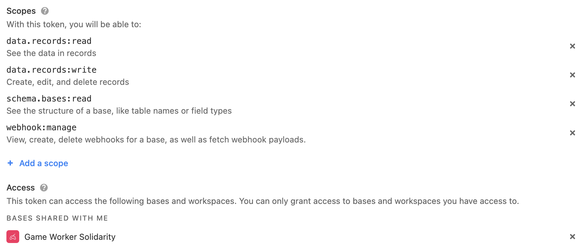

#  [gameworkersolidarity.com](https://gameworkersolidarity.com)

Game Worker Solidarity is mapping and documenting collective movements by game workers striving to improve their working conditions. We're collecting materials created by workers for these movements and aim to document the longer history of resistance in the industry which goes back to its formation.

This repository is for a website backed by a database of events that can be freely searched by location, type of action, and numbers involved for events like the creation of trade union branches, new contracts, strikes, protests, social media campaigns, etc.

Where possible, we'll also interview and record oral histories with participants of these movements to produce a living resource that can help support and inspire more organising in the games industry.

Do you have any information to share with us that we can add to the timeline? [Get in touch!](mailto:hello@gameworkersolidarity.com)

# Technical documentation

Check out this [early stage, highly WIP documentation for the overall system.](https://www.notion.so/commonknowledge/System-Documentation-9986bf296f5341d0b0f0c1f66b67cd24) Later we will transpose that content to this README file.

## Getting started: run it on your machine

First, download the code from github (e.g. `git clone`).

You will need to copy `.env.template` to `.env.local` and fill out the required env variables.

- The Airtable private API key can be found [here, in your account settings.](https://airtable.com/account)

To run the system locally, on your machine you will need:

- `node` (recommend installing and managing this via [`nvm`](https://github.com/nvm-sh/nvm#installing-and-updating))
- ideally also [`yarn`](https://yarnpkg.com/getting-started/install), because we pin specific versions of package dependencies using yarn (see [`./yarn.lock`]('./yarn.lock'))

Install the required package dependencies:

```bash
yarn
# or
npm install
```

Then you can run the development server:

```bash
yarn dev
# or
npm run dev
```

Open [http://localhost:3000](http://localhost:3000) with your browser to see the result.

## Development guide

This is a [Next.js](https://nextjs.org/) project bootstrapped with [`create-next-app`](https://github.com/vercel/next.js/tree/canary/packages/create-next-app). To learn more about Next.js, take a look at the following resources:

- [Next.js Documentation](https://nextjs.org/docs) - learn about Next.js features and API.
- [Learn Next.js](https://nextjs.org/learn) - an interactive Next.js tutorial.

### Pages

You can start editing the page by modifying `pages/index.js`. The page auto-updates as you edit the file.
### API routes

[API routes](https://nextjs.org/docs/api-routes/introduction) can be accessed on [http://localhost:3000/api/hello](http://localhost:3000/api/hello). This endpoint can be edited in `pages/api/hello.js`.

The `pages/api` directory is mapped to `/api/*`. Files in this directory are treated as [API routes](https://nextjs.org/docs/api-routes/introduction) instead of React pages.

### Typescript interfaces and parsers

In development we've been generating schemas from typescript interfaces, to help smooth out API responses. When things aren't as expected, they don't show up.

To add to the schema, add interfaces to `types.ts`.

To regenerate the schema (at `schema.ts`):

```bash
yarn generateschema
```

## Deployment

This repo auto-deploys to Digital Ocean.

## CDN for public file hosting

Cloudinary is used as a public CDN for Airtable images. Here's how it works:

- The `/api/syncToCDN` endpoint is responsible for refreshing the `cdn_urls` to sync Airtable's private attachments to the public CDN and then store the public URLs back in Airtable for serving in the frontend.
- The hidden `cdn_urls` column which stores data about the publicly viewable URLs should not be edited manually.
- Whenever an Airtable record is updated, a webhook will trigger the re-sync. A [Github action](./.github/workflows/refreshWebhook.yml) regularly triggers [maintenance script](./pages/api/createOrRefreshAirtableWebhook.ts), which will create/refresh the managed webhook to the Airtable.
- The webhook management script requires an access token in the env (`AIRTABLE_API_KEY`) configured [via this URL](https://airtable.com/create/tokens/new) as follows:
    
